# 🚀 Space Sim — Real Scale Solar System

Browser-based space flight simulator with **real physical scale** — real planet sizes, masses, distances, and orbital mechanics. Built with pure JavaScript + Three.js, no build step.

Fly a shuttle through the Solar System in the scale you were never supposed to feel.

  

## Gallery

### Earth — 8K daymap with PBR ocean + night city lights
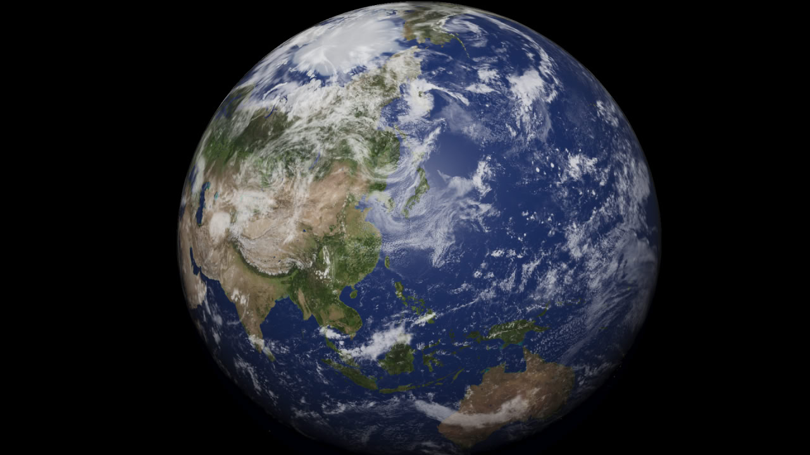
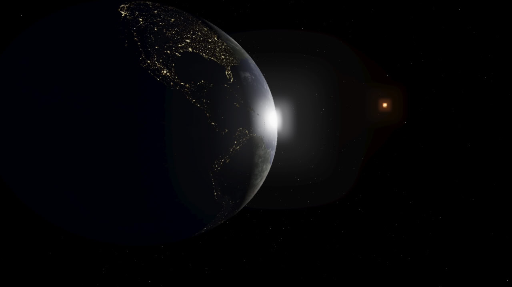

### The Sun — HDR overbright core + multi-layer corona + bloom
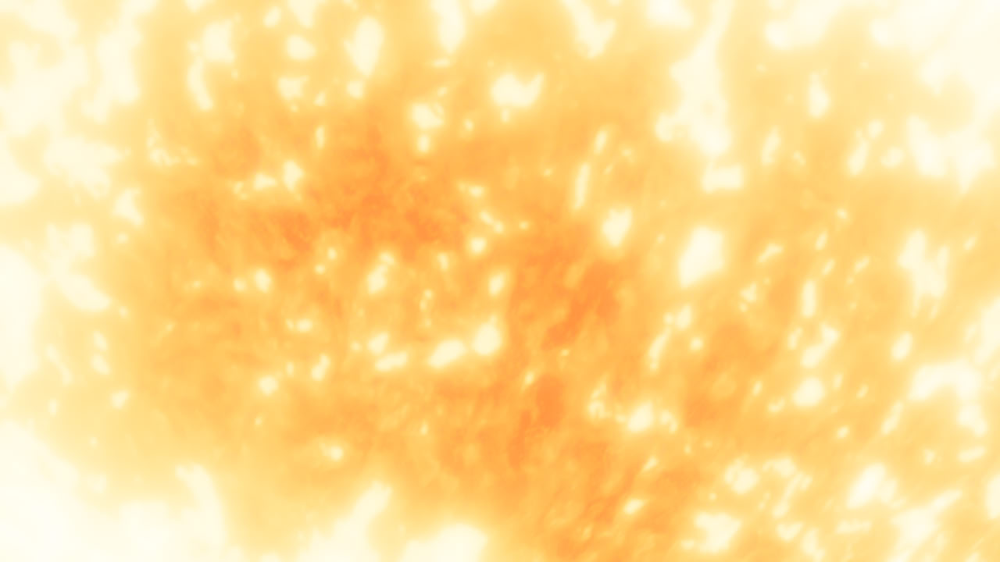

### Saturn & Titan through the telescope (zoom up to 180,000×)
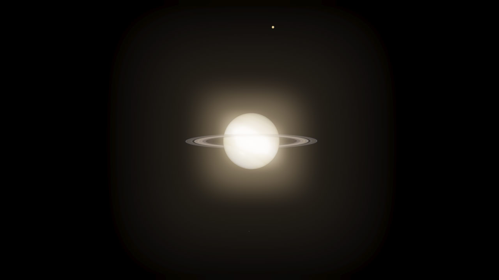

### Mars and its moons — Phobos & Deimos
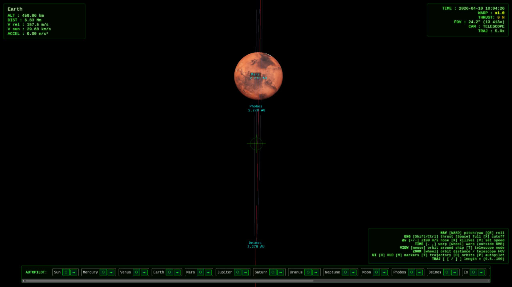
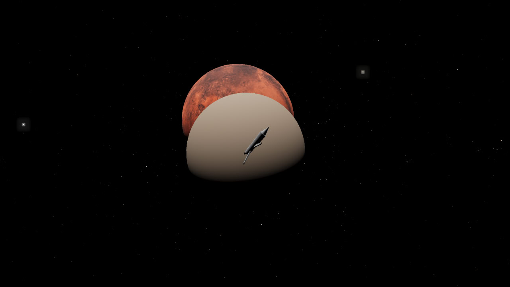
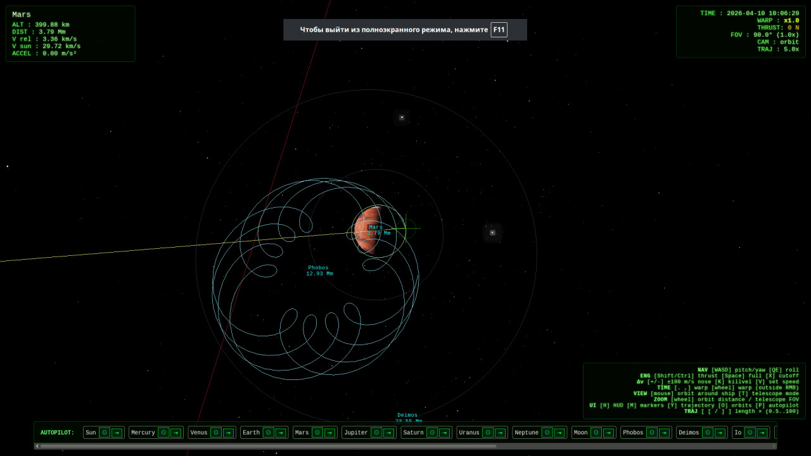
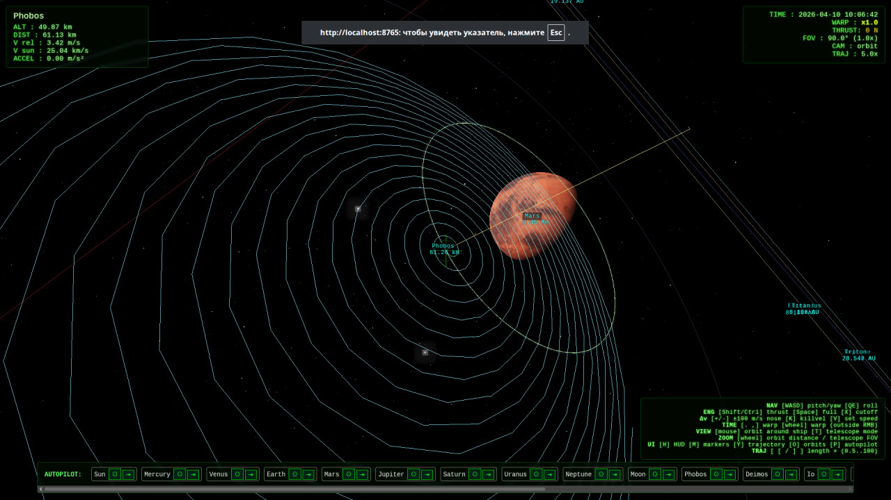

### Solar System overview with all orbits and autopilot
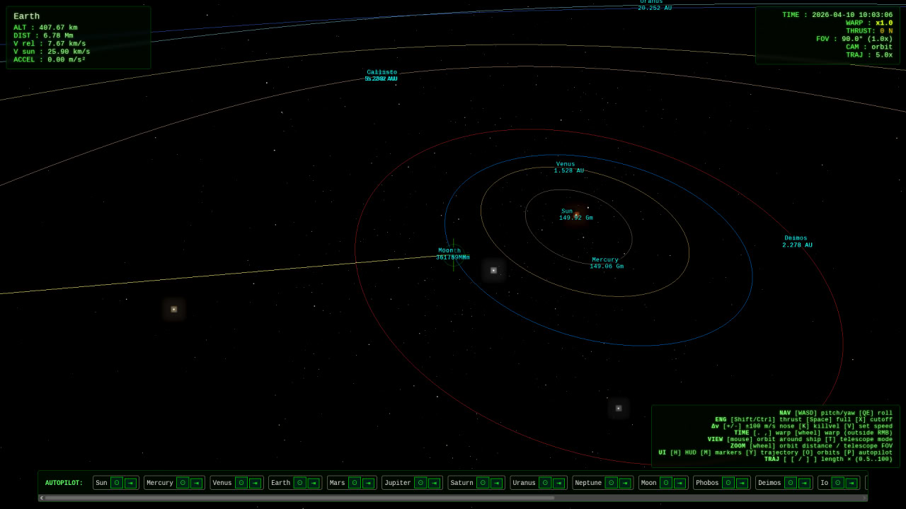

### In flight — engine burn near Earth
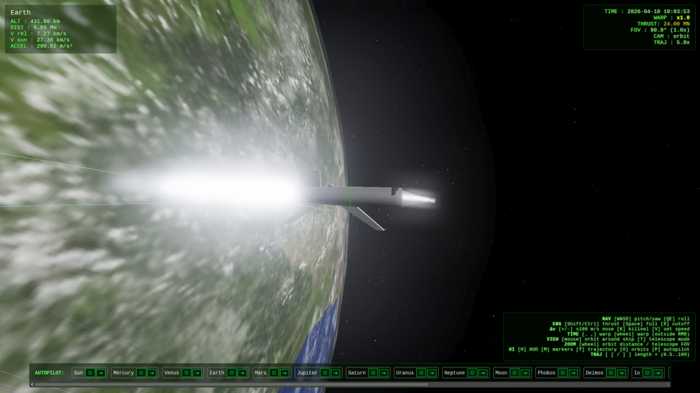
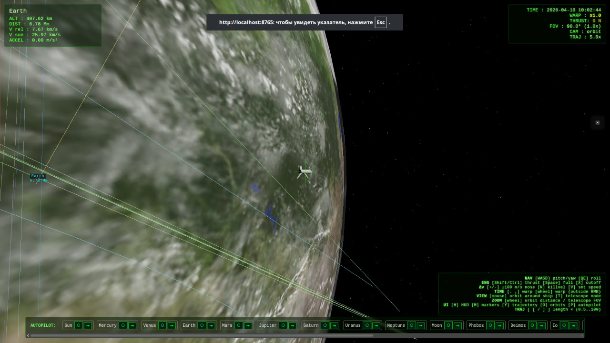

### Cinematic — body crescent silhouette
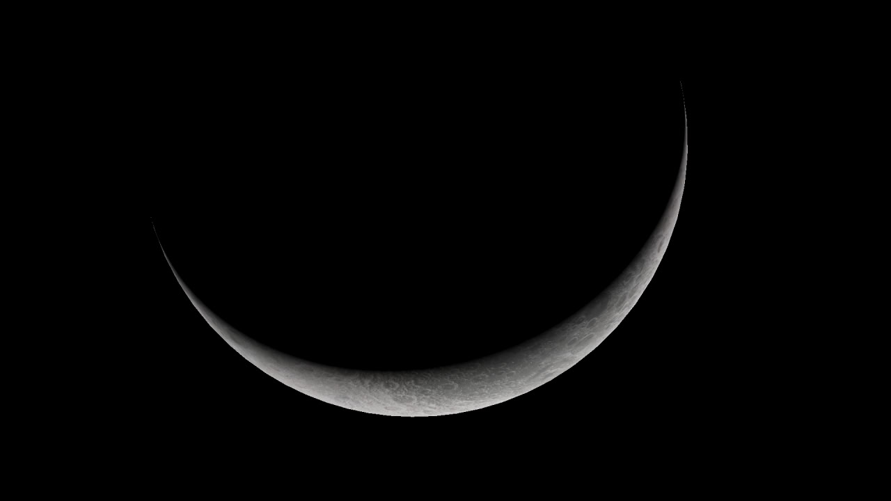

### The scale problem — Jupiter from Earth orbit (why you need a telescope)
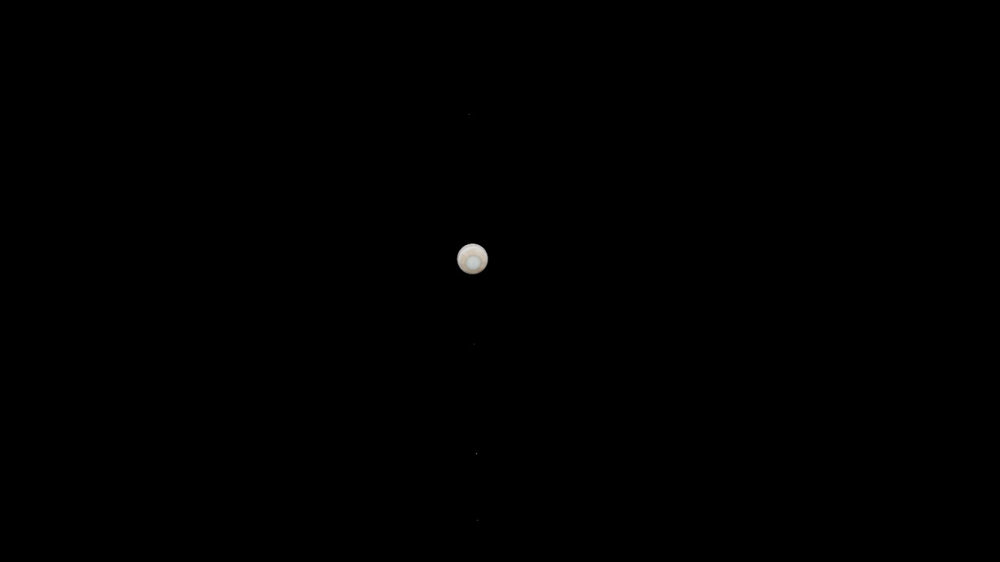
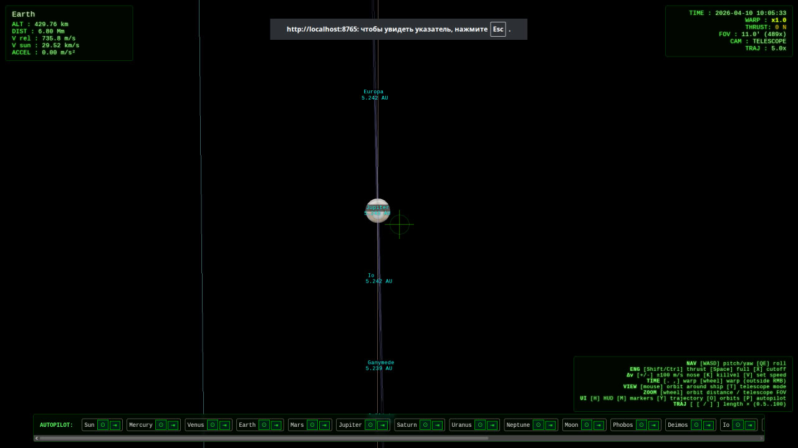

## What's real

- **Real planetary data** from JPL/NASA J2000 ephemerides — masses, radii, orbital elements of 8 planets + 12 moons
- **Newtonian gravity** from all bodies, Velocity Verlet integrator for the shuttle
- **Keplerian orbits** for planets (stable at any time warp)
- **8K textures** from solarsystemscope.com (Sun, Earth, Moon, Mars, Jupiter, Saturn)
- **Earth PBR**: normal map (terrain relief), specular map (ocean reflects, land doesn't), cloud layer, night city lights that glow **only on the dark side** via custom shader
- **Axial rotation** — all bodies spin on their real-period axes with real axial tilts (Earth 23.44°, Uranus 97° sideways, Venus retrograde)
- **HDR Sun** — overbright core + three-layer corona, tone-mapped bloom glow
- **5000 real stars** from the HYG Database — actual constellations at real RA/Dec, colored by B-V index (blue/white/yellow/orange/red by spectral class)
- **Start position** — circular orbit of Earth at ISS altitude (408 km), orbital velocity ~7.66 km/s

## Setup

```bash
git clone https://github.com/DrSeedon/space-sim.git
cd space-sim
python3 -m http.server 8000
```

Open `http://localhost:8000`. No npm, no build, no bundler.

## Controls

### Flight
| Key | Action |
|---|---|
| `W` / `S` | Pitch (nose up/down) |
| `A` / `D` | Yaw (nose left/right) |
| `Q` / `E` | Roll |
| `Shift` / `Ctrl` | Thrust +/- (Newtons, no cap) |
| `Space` | Burst to 5× base thrust |
| `X` | Engine cutoff |
| `+` / `-` | Delta-v ±100 m/s along nose |
| `K` | Kill velocity (zero relative to nearest body) |
| `V` | Set exact speed (prompt) |

### Time & View
| Key | Action |
|---|---|
| `.` / `,` | Time warp +/- (x1 → x1,000,000, logarithmic) |
| `T` | Toggle telescope mode (hides ship, 360° free look) |
| Mouse wheel | Orbit: camera distance / Telescope: FOV zoom (up to 180,000×) |
| Mouse | Orbit: spin camera around ship / Telescope: look direction |
| `[` / `]` | Trajectory length multiplier (0.5×..100×) |

### UI
| Key | Action |
|---|---|
| `H` | Hide all HUD (panels + trajectories + orbits) |
| `M` | Toggle planet markers |
| `Y` | Toggle shuttle trajectories (3 colors: Sun/planet/moon) |
| `O` | Toggle body orbits (all planets + moons as ellipses) |
| `P` | Toggle autopilot panel |

### Autopilot
Click `⊙` next to any body → ship rotates to point at it.
Click `⇥` → instantly teleport to a circular orbit around that body.

## Tech stack

- **Three.js** r160 (via CDN importmap, no npm)
- **ES6 modules** — one HTML + `<script type="module">`
- **No build step** — static files + `python -m http.server`
- Physics: custom Newtonian + Kepler hybrid
- Rendering: WebGL via Three.js, UnrealBloomPass, ACES Filmic tone mapping, logarithmic depth buffer
- Star catalog: HYG Database v41 (filtered to mag ≤ 6.5, top 5000)

## Project structure

```
space-sim/
├── index.html          # entry point (importmap + canvas)
├── src/
│   ├── main.js         # game loop
│   ├── constants.js    # JPL ephemerides, rotation periods, axial tilts
│   ├── physics.js      # Kepler + Verlet integrator
│   ├── renderer.js     # Three.js scene, PBR Earth shader, Sun corona
│   ├── ship.js         # procedural shuttle model
│   ├── exhaust.js      # particle engine
│   ├── shuttle.js      # shuttle state & maneuvers
│   ├── controls.js     # input handling
│   ├── camera.js       # orbit + telescope modes
│   ├── timewarp.js     # log-scale time multiplier
│   ├── trajectory.js   # shuttle orbit prediction
│   ├── bodyorbits.js   # static ellipses for planets/moons
│   ├── stars.js        # HYG catalog loader
│   ├── hud.js          # HTML overlay instruments
│   └── autopilot.js    # target list UI
└── assets/
    ├── textures/       # 8K planet textures
    └── stars/          # HYG catalog
```

## Known issues / TODO

See [TODO.md](TODO.md). Main planned features:

- Atmosphere shader for Earth (Rayleigh/Mie scattering)
- HUD minimap of the system
- Prograde/retrograde navigation markers (KSP-style)
- State persistence in localStorage
- Maneuver nodes & Hohmann transfer assist

## Credits

- Planet textures: [Solar System Scope](https://www.solarsystemscope.com/textures/) (CC BY 4.0)
- Star catalog: [HYG Database](https://github.com/astronexus/HYG-Database) (Public Domain)
- Orbital elements: NASA JPL Keplerian approximations for J2000 epoch
- [Three.js](https://threejs.org/)

## License

MIT
